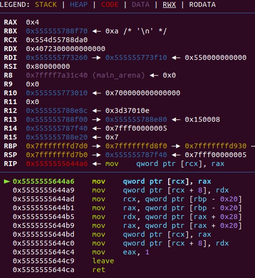

# wp for plang
# reverse the struct
First, run the poc given,we can find a crash, thus, we can have a shotcut of the struct  
  
thus, we can find a small check  
but wait, why our input 0x123 -> 0x4072300000000000  
ohhh, that is a double in memory  
and so, we can use search -p to locate the value we input  
and then we use this code to find the memory structure  
```
var a = 0x123
a = 0x124
```  
and so on,use this code to locate what string and array in memory  
```
var b = "this is a poc"
var c = [1,2,3,0x123]
```  
then change the size in the string struct, use the oob   
```
b[-(0xee0/16)]=1
```
# leak heap
if the string size has been changed, we can use the charAt function to leak heap  
4 for double; 5 for string
# fake struct
use the oob to change the double array struct address, write a  
```
4 | 4
```
# arbitrarily read
such that target is the memory we want to read  
we nned to do:  
target - 0x10 : 4  
target - 0x8 : 4  
target : memory  
write 4 | 4 into target - 0x8  
and then change the buffer to target - 0x8  
when we tried leak, we can recv the memory in double  
# arbitartily write
it's easy according to arbitrarily read